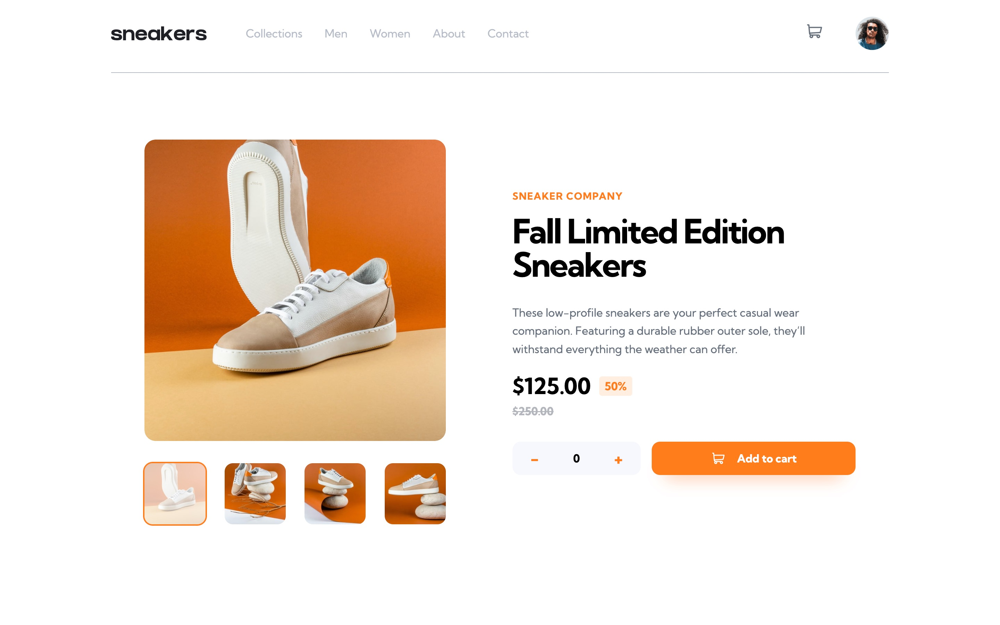

# Frontend Mentor - E-commerce product page solution

This is a solution to the [E-commerce product page challenge on Frontend Mentor](https://www.frontendmentor.io/challenges/ecommerce-product-page-UPsZ9MJp6). Frontend Mentor challenges help you improve your coding skills by building realistic projects.

## Table of contents

- [Overview](#overview)
  - [The challenge](#the-challenge)
  - [Screenshot](#screenshot)
  - [Links](#links)
- [My process](#my-process)
  - [Built with](#built-with)
  - [What I learned](#what-i-learned)
  - [Continued development](#continued-development)
  - [Useful resources](#useful-resources)
- [Author](#author)

## Overview

This was a good project to work on and grow front end skills. It is desktop and mobile friendly. I took a desktop first approach and then adapted it to mobile. No frameworks or libraries just used regular HTML, CSS and JS. I did use SCSS to make the styling a little easier.

### The challenge

Users should be able to:

- View the optimal layout for the site depending on their device's screen size
- See hover states for all interactive elements on the page
- Open a lightbox gallery by clicking on the large product image
- Switch the large product image by clicking on the small thumbnail images
- Add items to the cart
- View the cart and remove items from it

### Screenshot

You can see other screenshots in the screenshot folder.

### Links

- Solution URL: [Github Repo](https://github.com/calebmcmains/fm-ecommerce-product-page)
- Live Site URL: [Github Page](https://calebmcmains.github.io/fm-ecommerce-product-page/)

## My process

I spent a good amount of time visualizing the site design. I did not have the figma file. Usually I would just eyeball it but I decided to upload the screen shots to figma and build different elements over the screen shot in figma to determine spacing, font sizes, etc...

After looking everything over I started to make all of my variables using SCSS. Putting everything in figma was helpful becuase I was able to easliy translate things over to SCSS variables.
You can see a screen shot of what I build in figma to make things easier for me. [Figma Screenshot](./screenshots/figma.jpg).
This made styling so much easier and makes changes in the future easier casue most things are based on the variables.
I also seperated my SCSS files into six files:

1. \_variables.scss for all my variables
2. \_resests.scss for setting up my styling environment at a good nuetral spot
3. \_general.scss for things I could use anywhere even on a different page of the site if there was one
4. \_style.scss for anything custome to the specific page and elements I was working with
5. \_queries.scss for changing styles to fit specific screen sizes as I moved down to mobile
6. final.scss this was where using SCSS syntax brought it all together.
   **note: I used a vs code extention as my SCSS compiler [Live Sass Compiler](https://marketplace.visualstudio.com/items?itemName=glenn2223.live-sass)**

- I wrote the html by section, so whatever looked like section in the design I would write that HTML
- I got the HTML to where I thought it made sense I wrote classes for all the elements and moved them over to my CSS
- Then I stated styling in SCSS to make it look like the design screenshot provided
- Reinse and repeat for each section
- Once the destop view looked right I added all my Javascript for the lightbox, switching images and the cart

After the desktop view looked good I moved onto making it work with mobile using media queries, added Javascript as well where needed to make it all function correctly.

### Built with

- Semantic HTML5 markup
- CSS custom properties
- SCSS variables
- Vanilla JS
- Flexbox
- Desktop-first workflow
- [SCSS](https://sass-lang.com) - CSS Preprocessor

### What I learned

Oh man where do I start....I was constantly googling things! The most difficult peice for me was the light box and the cart.

LIGHTBOX
There is so much that goes into a functioning lightbox, especially when working with static images and different sizes of images.
Coolest thing I learned was that you can utilize media queries in javascript. For example I was able to remove the ability to click the main image in mobile view so that the lightbox isnt used.
I am sure there are other ways I could of gone about it but it works and I learned something I didn't know before.

CART
I wanted things to be relativly realistic so I learned how localstorage works. That way it could act as a"database" for the person shopping. If you notice you can close your browser and reopen it and if you added something to the cart before you closed out it will still be there.

### Continued development

I want to grow in my speed of development and also I'd like to explore React. It something I havnt touched much but I think aspects of this project would of been handled easier than with vanilla JS and html.

### Useful resources

- [Google](https://www.google.com) - I'm serious...don't hesitate to google things....but please work on being GOOD and googling. There is a difference.
- [Javascript matchMedia()](https://developer.mozilla.org/en-US/docs/Web/API/Window/matchMedia) - this helped me work with the lightbox being usable during certain media queries.

## Author

- Website - [Caleb McMains](https://www.calebmcmains.com)
- Frontend Mentor - [@calebmcmains](https://www.frontendmentor.io/profile/calebmcmains)
